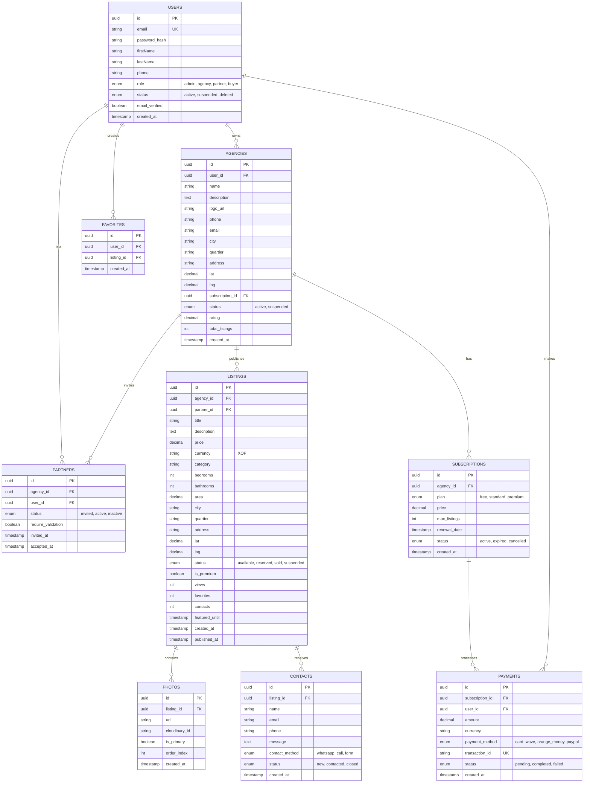
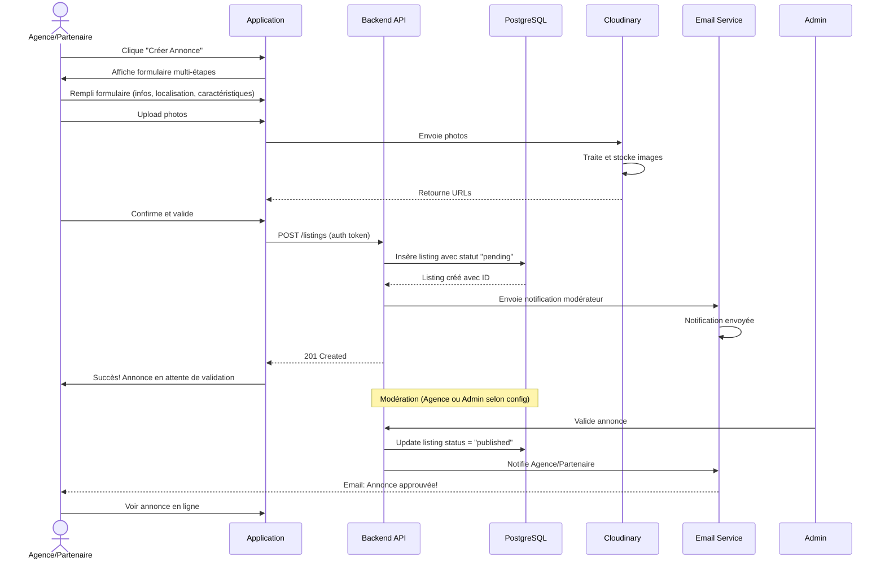
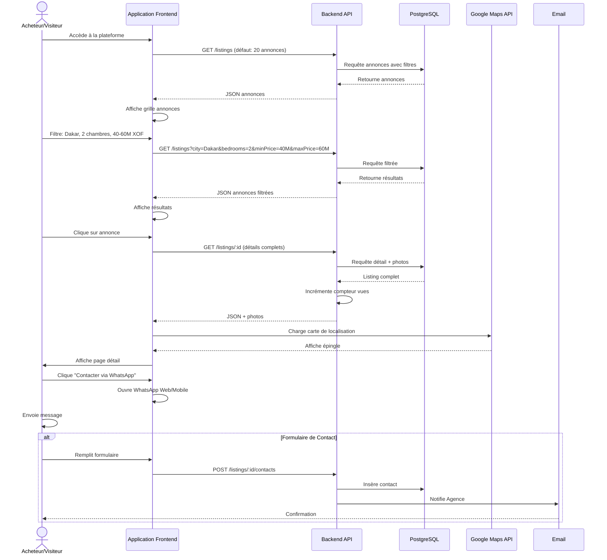
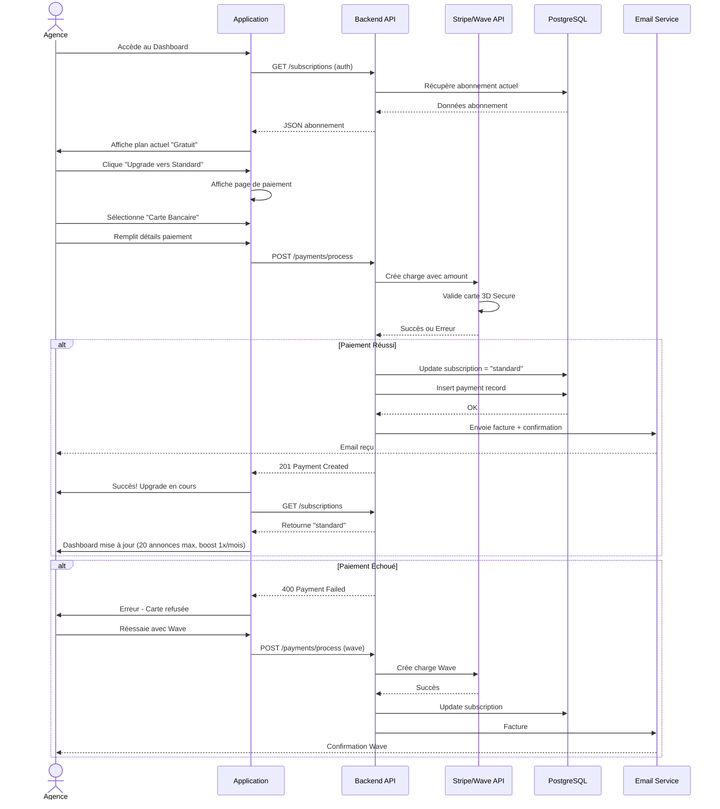
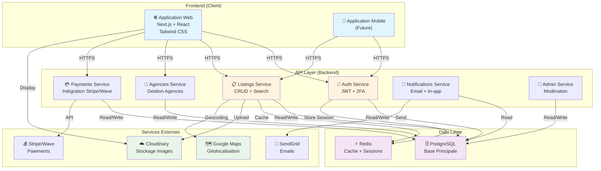
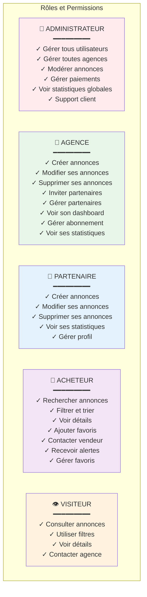
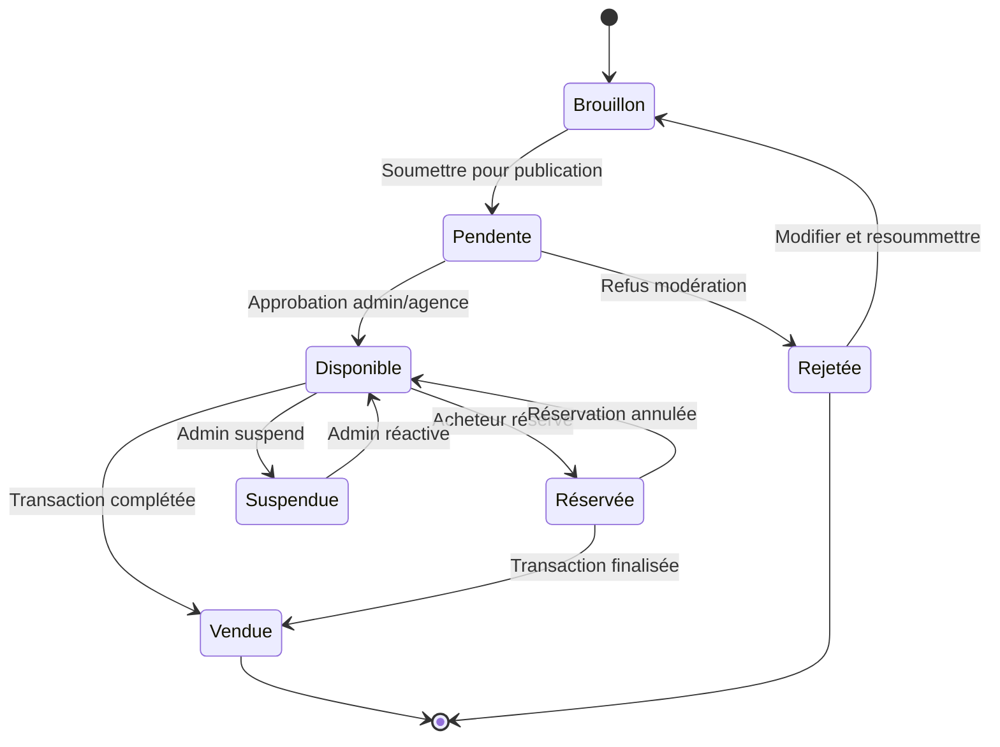
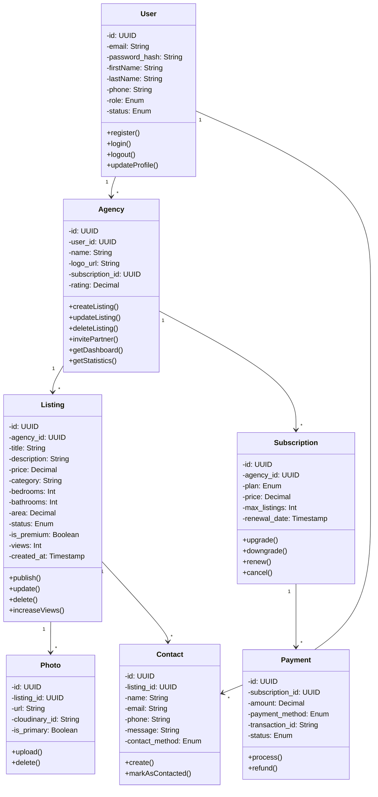

# DIAGRAMMES MERMAID - PLATEFORME IMMOBILIÈRE

## 1. DIAGRAMME ENTITÉ-RELATION (ER)

---

## 2. DIAGRAMME UML - USE CASES

```mermaid
graph TB
    subgraph Acteurs["Acteurs du Système"]
        Visiteur["👤 Visiteur"]
        Acheteur["👤 Acheteur"]
        Agence["🏢 Agence"]
        Partenaire["🤝 Partenaire"]
        Admin["🔐 Admin"]
    end

    subgraph UseCases["Cas d'Usage Principaux"]
        UC1["Consulter Annonces"]
        UC2["Filtrer & Rechercher"]
        UC3["Voir Détail Annonce"]
        UC4["Ajouter aux Favoris"]
        UC5["Contacter Vendeur"]
        UC6["Créer Compte"]
        UC7["Se Connecter"]
        UC8["Créer Annonce"]
        UC9["Modifier Annonce"]
        UC10["Supprimer Annonce"]
        UC11["Publier Annonce"]
        UC12["Inviter Partenaire"]
        UC13["Gérer Partenaires"]
        UC14["Consulter Dashboard"]
        UC15["Gérer Abonnement"]
        UC16["Effectuer Paiement"]
        UC17["Modérer Contenu"]
        UC18["Gérer Utilisateurs"]
        UC19["Consulter Statistiques"]
        UC20["Gérer Support"]
    end

    Visiteur --> UC1
    Visiteur --> UC2
    Visiteur --> UC3
    Visiteur --> UC5

    Acheteur --> UC6
    Acheteur --> UC7
    Acheteur --> UC1
    Acheteur --> UC2
    Acheteur --> UC3
    Acheteur --> UC4
    Acheteur --> UC5

    Agence --> UC8
    Agence --> UC9
    Agence --> UC10
    Agence --> UC11
    Agence --> UC12
    Agence --> UC13
    Agence --> UC14
    Agence --> UC15
    Agence --> UC16

    Partenaire --> UC8
    Partenaire --> UC9
    Partenaire --> UC10
    Partenaire --> UC14

    Admin --> UC17
    Admin --> UC18
    Admin --> UC19
    Admin --> UC20
```

---

## 3. DIAGRAMME DE FLUX - PUBLICATION D'ANNONCE

---

## 4. DIAGRAMME DE FLUX - RECHERCHE ET CONTACT

---

## 5. DIAGRAMME DE FLUX - ABONNEMENT & PAIEMENT

---

## 6. DIAGRAMME D'ARCHITECTURE SYSTÈME

---

## 7. DIAGRAMME DE RÔLES & PERMISSIONS

---

## 8. DIAGRAMME D'ÉTATS - ANNONCE

---

## 9. DIAGRAMME DE CLASSES (Simplifié)

---

