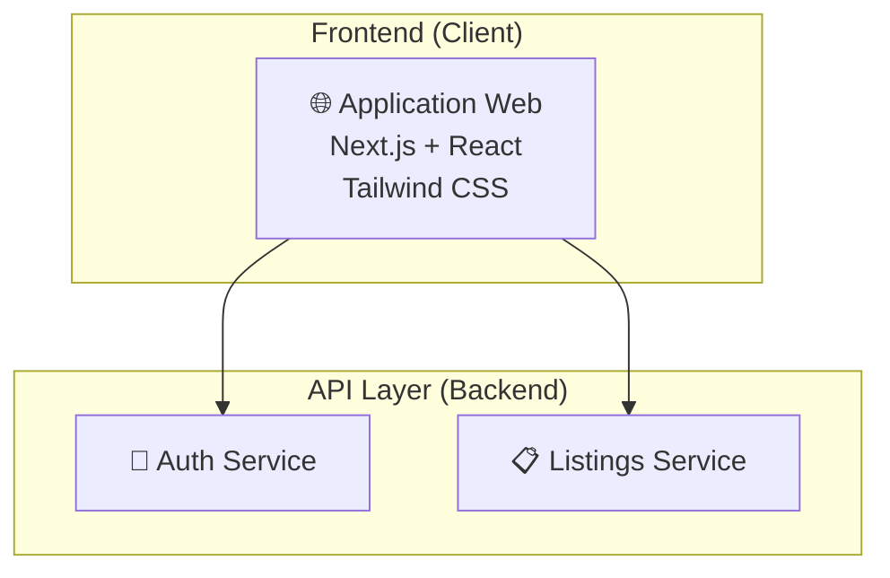
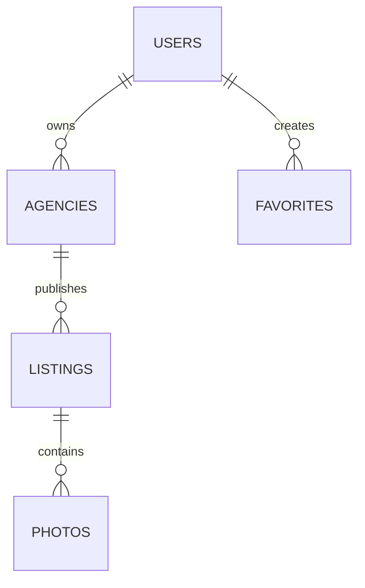

# Plateforme Immobilière

## Architecture du Système

```mermaid
graph TB
    subgraph Client["Frontend (Client)"]
        Web["🌐 Application Web<br/>Next.js + React<br/>Tailwind CSS"]
    end
    
    subgraph API["API Layer (Backend)"]
        Auth["🔐 Auth Service"]
        Listings["📋 Listings Service"]
    end
    
    Web --> Auth
    Web --> Listings
```

## Diagramme Entité-Relation

```mermaid
erDiagram
    USERS ||--o{ AGENCIES : owns
    USERS ||--o{ FAVORITES : creates
    AGENCIES ||--o{ LISTINGS : publishes
    LISTINGS ||--o{ PHOTOS : contains
```
